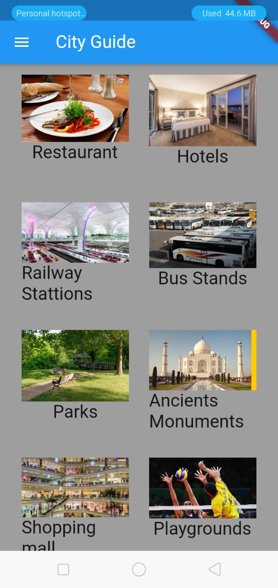
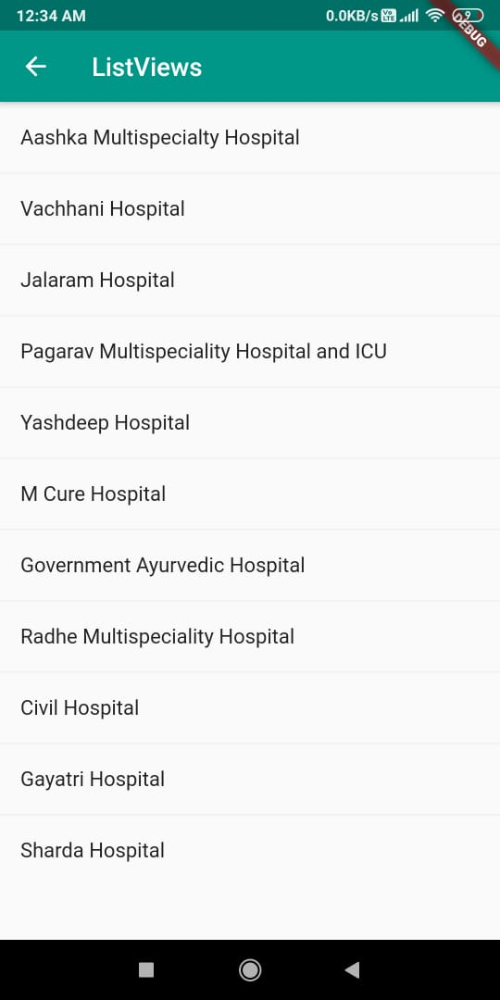
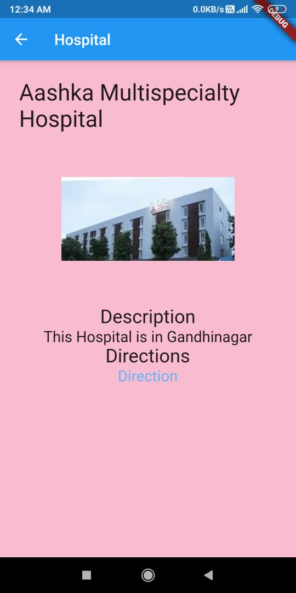

# City Guide App

* This was our first project in Flutter.
* In this project we applied the concept of OOPs.
* We used Firebase for sign up with google.

## Project Idea
The main idea behind the project city guide is to give users full
information about a particular city. This App is very helpful for the visitors who
are travelling first time in a particular city as it gives every detailed information
which the user desires let it be any visiting place, food, travelling, hotels etc all at
one place. The user need not go every website and check about it.

## Features

The App which we are making is very user friendly, the user
need not to follow many procedures. The starting page of the App contains a
Login Page like any other apps (it can be skipped). And the next page contains a
search bar which gives the user the options to select their particular city, and
after selecting the next page gives all the necessary information about that
particular city like tourist’s places, hotels, Airports, and many more things and
when the user selects a particular item it gives all the nearby places where that
item is there. And when the user selects it gives a brief description including the
link to its website (if necessary) of that particular item and shows its direction
using google maps.

# Screenshots

